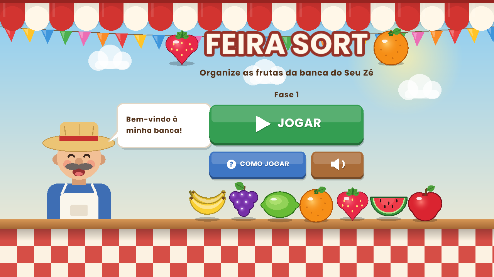
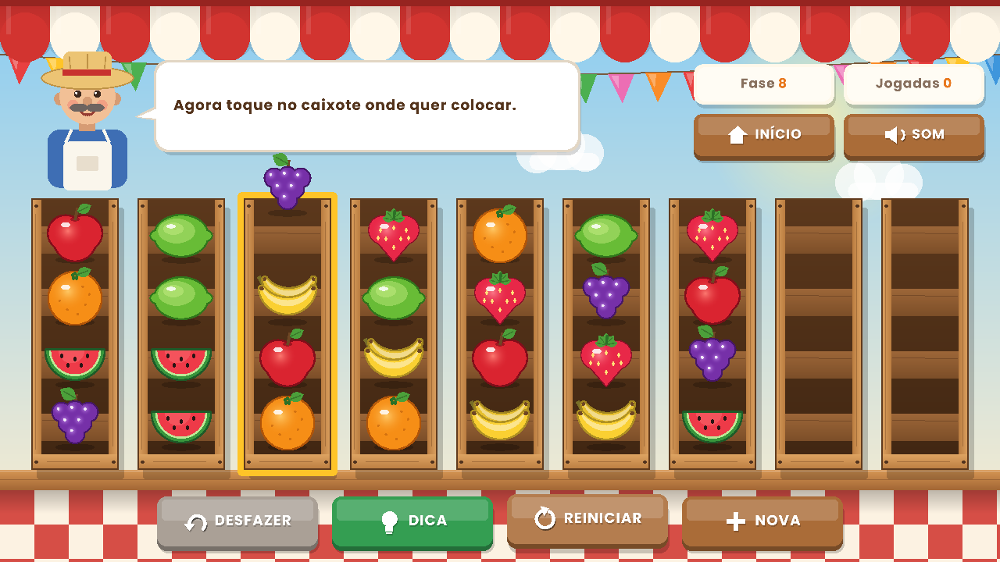
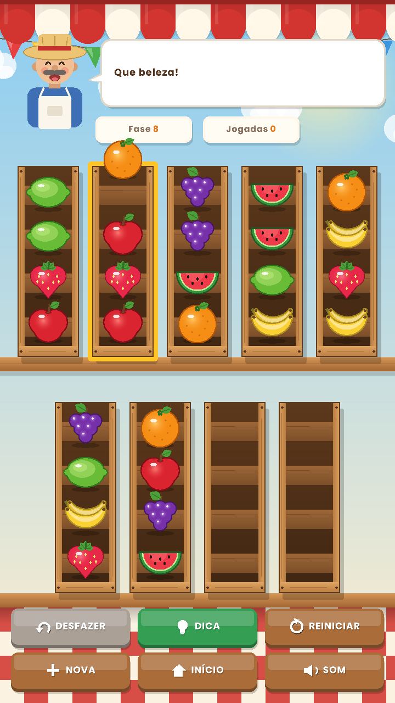

# 🍊 Feira Sort

**Jogo de puzzle pensado para o público 50+.** Ajude o Seu Zé a arrumar a banca: organize as frutas até que cada caixote tenha um só tipo de fruta.

### ▶️ [Jogue agora no navegador](https://diegogarciabalbo-cell.github.io/feira-sort/)
Funciona no computador e no celular, sem instalar nada.



## Por que este jogo existe

Jogos de "sort" como Magic Sort e Bus Fever Party são sucesso mundial, mas os jogadores reclamam de **excesso de anúncios**, **cronômetros que dão pressa** e **fases que travam sem aviso**. O Feira Sort resolve cada uma dessas dores para quem tem mais de 50 anos:

| Problema comum | Como o Feira Sort resolve |
|---|---|
| Anúncios a cada fase | Nenhum anúncio |
| Cronômetro e pressa | Sem tempo: jogue com calma |
| Cores difíceis de distinguir | Cada fruta tem um **formato** diferente |
| Letras pequenas | Botões e textos grandes, com ícones |
| Não sei o que fazer | O **Seu Zé**, feirante, orienta a cada passo |
| Travei e não percebi | O jogo **avisa na hora** e destaca o botão DESFAZER |
| Dica que não ajuda | A dica segue um **plano completo**: seguindo as dicas, você sempre termina |



## Recursos

- Tela inicial, tutorial "Como jogar" e fases com dificuldade crescente (3 a 7 frutas)
- Estrelas no fim da fase (3 estrelas sem usar dicas)
- Confete, animações suaves e frutas que "pulam" ao cair no caixote
- Música de feira e efeitos sonoros **gerados pelo próprio código**, com botão para desligar
- Progresso salvo automaticamente
- Tela que se adapta: **deitada** (computador) ou **em pé** (celular)
- Toda arte é desenhada por código, sem nenhuma imagem

| Vitória | Celular |
|---|---|
|  |  |

## Como rodar (Linux)

Instale a raylib 4.2 (só na primeira vez):

```bash
sudo apt install build-essential git libx11-dev libxcursor-dev libxrandr-dev libxinerama-dev libxi-dev libgl1-mesa-dev
git clone --depth 1 --branch 4.2.0 https://github.com/raysan5/raylib.git
cd raylib/src && make PLATFORM=PLATFORM_DESKTOP && sudo make install && cd ../..
```

Compile e jogue (a fonte `Poppins-Bold.ttf` precisa ficar na mesma pasta):

```bash
make
./feira_sort
```

Tecla **F11**: tela cheia.

## Versão web (navegador)

O mesmo código C++ é compilado para WebAssembly com o Emscripten e publicado pelo GitHub Pages:

```bash
./compilar-web.sh
```

No navegador, o progresso fica salvo no `localStorage`, a tela acompanha o tamanho da janela e o jogo aceita toque no celular.

## Organização do código

| Arquivo | O que faz |
|---|---|
| `src/regras.h` | Regras do jogo, geração de fases e o **resolvedor** |
| `src/arte.h` | Todo o desenho: cenário, frutas, caixotes, feirante, botões, confete |
| `src/som.h` | Síntese de áudio: efeitos e música |
| `src/main.cpp` | Telas, layout adaptável e controle do jogo |
| `web/shell.html` | Página que carrega o jogo no navegador |
| `compilar-web.sh` | Compila a versão web para a pasta `docs/` |

## Destaques técnicos

- **Busca em profundidade (DFS) com backtracking e memorização** (`unordered_set` de estados), usada para:
  - garantir que toda fase sorteada tem solução
  - dar dicas e detectar quando o jogador travou
- **Ordenação heurística das jogadas** (empilhar frutas iguais primeiro, usar caixote vazio por último): reduziu a solução média das fases difíceis de cerca de 30 para 23 jogadas
- **Plano de dica em cache**: evita que dicas seguidas fiquem andando em círculos (bug encontrado por teste automatizado)
- Tela virtual com câmera 2D: o mesmo layout funciona em qualquer resolução
- Síntese de som: ondas senoidais com harmônicos e envelope de ataque e decaimento

## Próximos passos

- [x] Versão web jogável no navegador
- [ ] Versão Android para a Google Play
- [ ] Documento de casos de teste (QA)

## Créditos

Criado por **Diego Garcia Balbo**. Fonte [Poppins](https://fonts.google.com/specimen/Poppins) (Indian Type Foundry), sob a SIL Open Font License 1.1.
