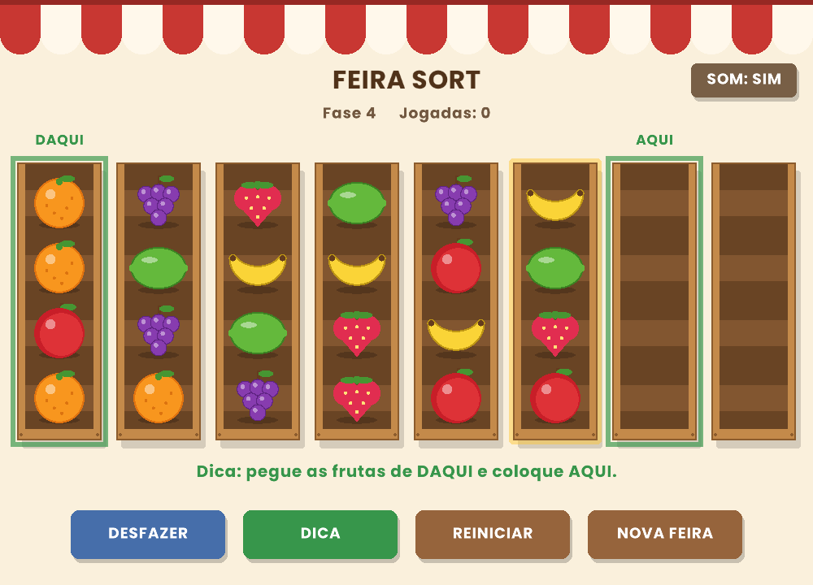

# 🍊 Feira Sort

Jogo de puzzle em C++: organize as frutas da feira até que cada caixote tenha um só tipo de fruta.



## A ideia

Jogos de "sort" como Magic Sort e Bus Fever Party fazem muito sucesso, mas os jogadores reclamam de excesso de anúncios e de fases que travam sem aviso. O Feira Sort foi pensado para o **público 50+**:

- Sem cronômetro e sem anúncios
- Frutas grandes, com **formatos diferentes** (não depende só da cor)
- Desfazer ilimitado
- **Dica que sempre funciona**: o jogo resolve a feira sozinho e mostra a próxima jogada certa
- **Aviso de travamento**: se uma jogada deixa a feira sem solução, o jogo avisa na hora
- Toda feira sorteada é verificada e **sempre tem solução**
- Fases com dificuldade crescente (de 3 a 6 frutas), e o jogo **lembra a fase** onde você parou
- Sons gerados pelo próprio código (sem arquivos de áudio), com botão para desligar

## Arquivos

| Arquivo | Descrição |
|---|---|
| `feira_grafico.cpp` | Jogo completo, com gráficos e mouse (raylib) |
| `Poppins-Bold.ttf` | Fonte com acentos (precisa ficar na mesma pasta do jogo) |
| `feira_sort.cpp` | Primeira versão, no terminal |

## Como rodar (Linux)

Instale a raylib (só na primeira vez):

```bash
sudo apt install build-essential git libx11-dev libxcursor-dev libxrandr-dev libxinerama-dev libxi-dev libgl1-mesa-dev
git clone --depth 1 --branch 4.2.0 https://github.com/raysan5/raylib.git
cd raylib/src && make PLATFORM=PLATFORM_DESKTOP && sudo make install && cd ../..
```

Compile e jogue:

```bash
g++ -std=c++17 -O2 feira_grafico.cpp -o feira_grafico -lraylib -lGL -lm -lpthread -ldl -lrt -lX11
./feira_grafico
```

## Conceitos de programação usados

- **Busca em profundidade (DFS) com backtracking e memorização** (`unordered_set`) para resolver a feira, gerar dicas e detectar travamento
- Poda da busca: ignora jogadas inúteis e trata caixotes vazios como equivalentes
- `vector` como pilha (caixotes) e histórico de estados para o "desfazer"
- Laço de jogo: entrada → atualização → desenho, a 60 quadros por segundo
- Animação com interpolação suave (smoothstep) em arco
- Síntese de áudio: ondas senoidais com envelope de ataque e decaimento
- Fonte TrueType com caracteres UTF-8 (acentos do português)
- Frutas desenhadas só com formas geométricas, sem imagens
- Gravação do progresso em arquivo (`fstream`)

## Próximos passos

- [ ] Versão web jogável no navegador
- [ ] Versão Android para a Google Play
- [ ] Fila de freguesas pedindo caixotes completos
- [ ] Documento de casos de teste (QA)

## Créditos

Fonte [Poppins](https://fonts.google.com/specimen/Poppins), da Indian Type Foundry, sob a SIL Open Font License 1.1.
