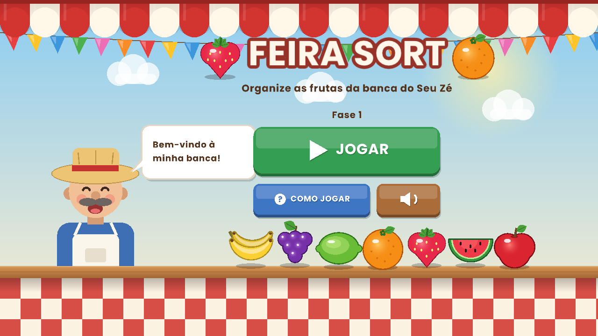
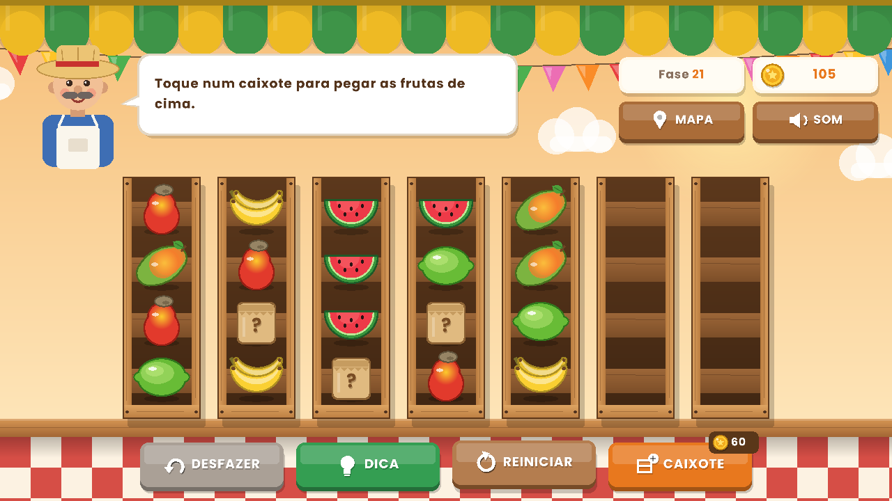
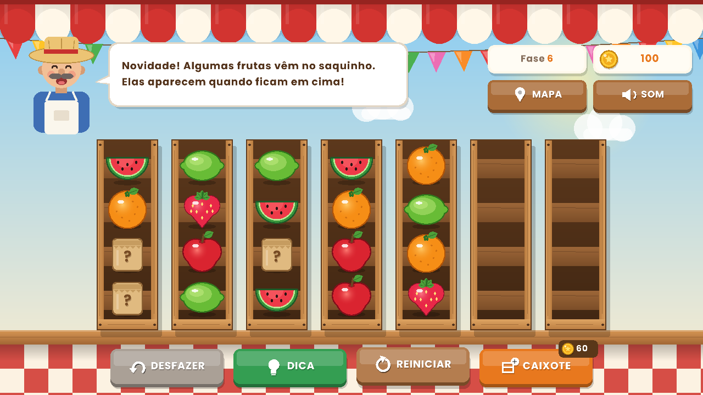
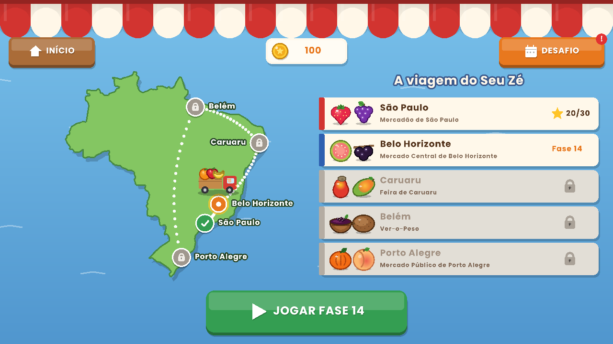
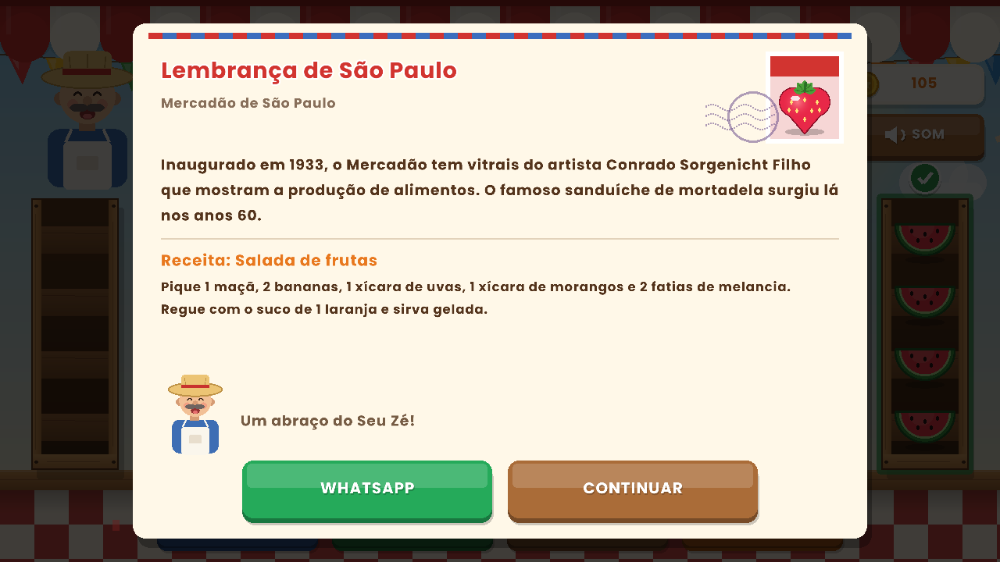
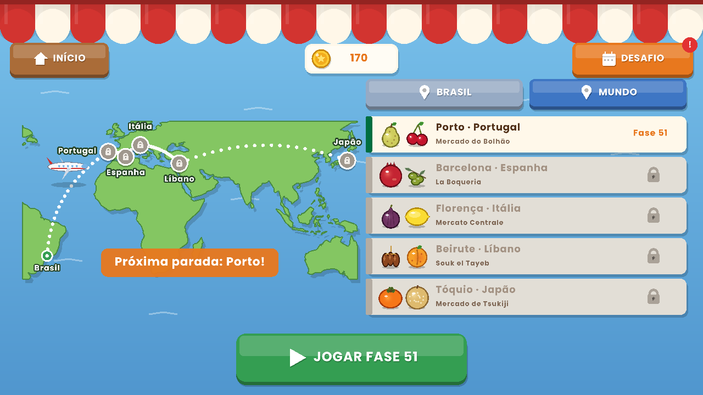
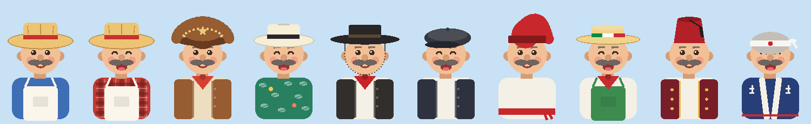
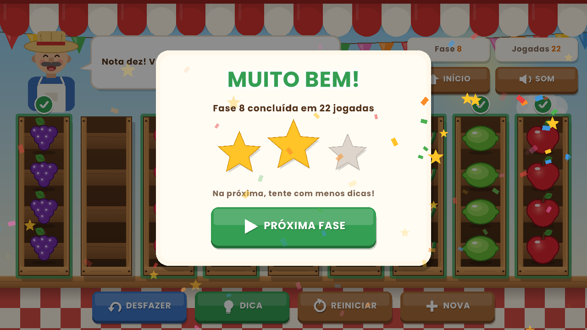
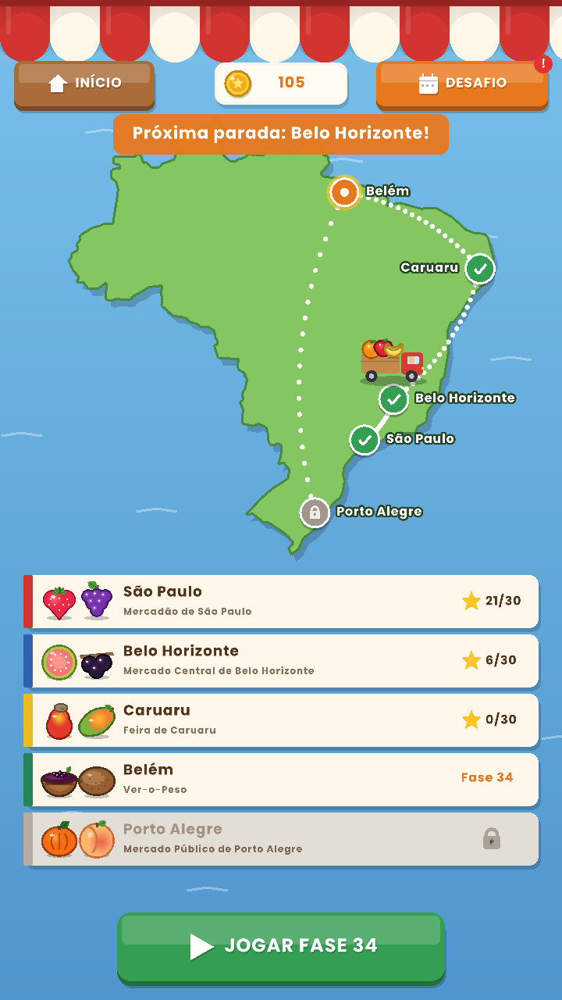
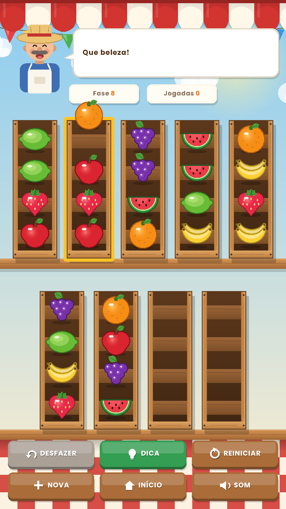

# 🍊 Feira Sort

**Jogo de puzzle pensado para o público 50+.** Viaje com o Seu Zé pelas feiras do Brasil e do mundo e ajude a arrumar a banca: organize as frutas até que cada caixote tenha um só tipo de fruta.

### ▶️ [Jogue agora no navegador](https://diegogarciabalbo-cell.github.io/feira-sort/)
Funciona no computador e no celular, sem instalar nada.



## Por que este jogo existe

Jogos de "sort" como Magic Sort e Bus Fever Party são sucesso mundial, mas os jogadores reclamam de **excesso de anúncios**, **cronômetros que dão pressa** e **fases que travam sem aviso**. O Feira Sort resolve cada uma dessas dores para quem tem mais de 50 anos:

| Problema comum | Como o Feira Sort resolve |
|---|---|
| Anúncios a cada fase | Nenhum anúncio |
| Cronômetro e pressa | Sem tempo: jogue com calma |
| Cores difíceis de distinguir | Cada fruta tem um **formato** diferente |
| Letras pequenas | Botões e textos grandes, com ícones |
| Não sei o que fazer | O **Seu Zé**, feirante, orienta a cada passo |
| Travei e não percebi | O jogo **avisa na hora** e destaca o botão DESFAZER |
| Dica que não ajuda | A dica segue um **plano completo**: seguindo as dicas, você sempre termina |





## A viagem pelas feiras do Brasil

Em vez de um mapa genérico, o jogo é uma **viagem de caminhão pelo Brasil**. Cada feira é um capítulo de 10 fases, com as frutas da região e cores próprias:

| Feira | Frutas da região | Postal com receita |
|---|---|---|
| Mercadão de São Paulo (SP) | morango e uva | Salada de frutas |
| Mercado Central de Belo Horizonte (MG) | goiaba e jabuticaba | Romeu e Julieta |
| Feira de Caruaru (PE) | caju e manga | Suco de caju |
| Ver-o-Peso, Belém (PA) | açaí e cupuaçu | Creme de cupuaçu |
| Mercado Público de Porto Alegre (RS) | bergamota e pêssego | Sagu de suco de uva |

Ao completar uma feira, o jogador ganha um **postal** com uma curiosidade verdadeira do lugar e uma receita típica, e pode **mandar o postal no WhatsApp** junto com o link do jogo. É o tipo de conteúdo que o público 50+ gosta de compartilhar com a família, e que faz o jogo se espalhar sozinho.





## Depois do Brasil, o mundo ✈️

Quem completa as 5 feiras do Brasil embarca num **avião** com o Seu Zé para mais 5 mercados famosos. São 25 frutas no total, cada uma com desenho próprio:

| Mercado | Frutas da região | Postal com receita |
|---|---|---|
| Mercado do Bolhão, Porto (Portugal) | pera e cereja | Pera cozida com canela |
| La Boqueria, Barcelona (Espanha) | romã e azeitona | Salada de laranja com azeitonas |
| Mercato Centrale, Florença (Itália) | figo e limão-siciliano | Figos assados com mel |
| Souk el Tayeb, Beirute (Líbano) | tâmara e damasco | Tâmaras recheadas |
| Mercado de Tsukiji, Tóquio (Japão) | caqui e nashi | Sanduíche de frutas (fruit sando) |

No total são **100 fases** (10 por feira). O mapa tem abas **BRASIL** e **MUNDO**, e a aba do mundo abre quando o jogador chega a Porto.



### O Seu Zé se veste como a gente de cada lugar

Chapéu de palha em São Paulo, camisa xadrez em Minas, chapéu de couro em Caruaru, pilcha gaúcha em Porto Alegre, boina no Porto, barretina em Barcelona, palhinha em Florença, tarbush em Beirute e hachimaki em Tóquio.



### Fotos dos mercados

Cada feira pode ter uma foto real do mercado, que aparece no postal e, desfocada e clarinha, no fundo das fases. Basta colocar na pasta `fotos/` o arquivo `<feira>.png` (por exemplo `fotos/porto.png`) e o crédito do fotógrafo em `fotos/<feira>.txt`. Sem a foto, o jogo usa o cenário desenhado.

## Recursos

Inspirados nos sucessos **Candy Crush** e **Magic Sort**, adaptados para o público 50+:

- 🗺️ **Mapa de fases** de cada feira, com estrelas conquistadas e o Seu Zé marcando onde você está
- ❓ **Frutas escondidas no saquinho** (a partir da fase 6): elas aparecem quando chegam ao topo
- 🪙 **Moedas** ganhas ao passar de fase
- 📦 **Caixotes de alturas diferentes**: em cada feira há fases rapidinhas (3 frutas por caixote) para descansar, fases normais (4) e a **banca grande** (5) no fim, antes do postal
- ↩️ **Desfazer até 3 vezes por fase**: ajuda sem tirar o desafio (o REINICIAR brilha quando acabam)
- 📦 **Caixote extra**: um reforço comprado com moedas quando a banca aperta
- 📅 **Desafio do dia**: uma fase especial por dia, que vale 100 moedas e cria o hábito de voltar
- Fases fixas: a fase 12 é igual para todo mundo e pode ser jogada de novo em busca de 3 estrelas
- Estrelas: 3 sem ajuda, 2 com até 2 dicas ou caixote extra, 1 com mais ajuda
- Tela inicial, tutorial "Como jogar" e dificuldade crescente (3 a 7 frutas)
- Confete, animações suaves e frutas que "pulam" ao cair no caixote
- Música de feira e efeitos sonoros **gerados pelo próprio código**, com botão para desligar
- Progresso salvo automaticamente
- Tela que se adapta: **deitada** (computador) ou **em pé** (celular)
- Toda arte é desenhada por código, sem nenhuma imagem

| Vitória | Mapa no celular | Desafio no celular |
|---|---|---|
|  |  |  |

## Como rodar (Linux)

Instale a raylib 4.2 (só na primeira vez):

```bash
sudo apt install build-essential git libx11-dev libxcursor-dev libxrandr-dev libxinerama-dev libxi-dev libgl1-mesa-dev
git clone --depth 1 --branch 4.2.0 https://github.com/raysan5/raylib.git
cd raylib/src && make PLATFORM=PLATFORM_DESKTOP && sudo make install && cd ../..
```

Compile e jogue (a fonte `Poppins-Bold.ttf` precisa ficar na mesma pasta):

```bash
make
./feira_sort
```

Tecla **F11**: tela cheia.

## Versão web (navegador)

O mesmo código C++ é compilado para WebAssembly com o Emscripten e publicado pelo GitHub Pages:

```bash
./compilar-web.sh
```

No navegador, o progresso fica salvo no `localStorage`, a tela acompanha o tamanho da janela e o jogo aceita toque no celular.

## Organização do código

| Arquivo | O que faz |
|---|---|
| `src/regras.h` | Regras do jogo, geração de fases e o **resolvedor** |
| `src/capitulos.h` | As 10 feiras: frutas, cores, curiosidades, receitas e dificuldade |
| `src/brasil.h` | Contorno do Brasil (202 pontos) já dividido em triângulos |
| `src/mundo.h` | Mapa-mundi recortado (787 pontos, 40 contornos) já dividido em triângulos |
| `src/arte.h` | Todo o desenho: cenário, frutas, caixotes, feirante, botões, confete |
| `src/som.h` | Síntese de áudio: efeitos e música |
| `src/main.cpp` | Telas, layout adaptável e controle do jogo |
| `web/shell.html` | Página que carrega o jogo no navegador |
| `compilar-web.sh` | Compila a versão web para a pasta `docs/` |

## Destaques técnicos

- **Busca em profundidade (DFS) com backtracking e memorização** (`unordered_set` de estados), usada para:
  - garantir que toda fase sorteada tem solução
  - dar dicas e detectar quando o jogador travou
- **Ordenação heurística das jogadas** (empilhar frutas iguais primeiro, usar caixote vazio por último): reduziu a solução média das fases difíceis de cerca de 30 para 23 jogadas
- **Plano de dica em cache**: evita que dicas seguidas fiquem andando em círculos (bug encontrado por teste automatizado)
- **Mapas do Brasil e do mundo desenhados com dados reais**: os contornos vieram de dados geográficos públicos, foram normalizados e divididos em triângulos com o algoritmo *ear clipping* (em Python), e as cidades foram posicionadas pela latitude e longitude
- **Compartilhamento**: o postal vira um link do WhatsApp com o texto codificado para URL
- **Níveis gerados por semente**: cada fase sai de um gerador aleatório com semente fixa, então é sempre a mesma; o desafio do dia usa a data como semente
- Progresso salvo em arquivo (computador) ou no `localStorage` (navegador), com migração do save da versão anterior
- Tela virtual com câmera 2D: o mesmo layout funciona em qualquer resolução
- Síntese de som: ondas senoidais com harmônicos e envelope de ataque e decaimento

## Próximos passos

- [x] Versão web jogável no navegador
- [ ] Versão Android para a Google Play
- [ ] Documento de casos de teste (QA)

## Créditos

**Fotos dos mercados** (Wikimedia Commons e Pexels; recortadas e reduzidas para o jogo, e mantidas sob a licença original):

| Feira | Foto | Autor | Licença |
|---|---|---|---|
| Mercadão de São Paulo | [Fachada da Rua da Cantareira](https://commons.wikimedia.org/wiki/File:Mercado_Municipal,_fachada_rua_da_Cantareira_2.JPG) | Dornicke | Domínio público |
| Ver-o-Peso, Belém | [Ver-o-Peso](https://commons.wikimedia.org/wiki/File:Ver-oPeso-Belem.jpg) | Mauricio Mercer | [CC BY-SA 2.0](https://creativecommons.org/licenses/by-sa/2.0/) |
| Mercado Central de Belo Horizonte | [Entrada do Mercado Central](https://commons.wikimedia.org/wiki/File:Mercado_Central,_Belo_Horizonte,_Minas_Gerais_-_2023-11-05_-_DSC01893_(cropped).jpg) | Paulo SP | [CC BY-SA 4.0](https://creativecommons.org/licenses/by-sa/4.0/) |
| Mercado Público de Porto Alegre | [Mercado Público](https://commons.wikimedia.org/wiki/File:Mercado_p%C3%BAblico_de_porto_alegre.jpg) | Tetraktys (Ricardo André Frantz) | [CC BY-SA 3.0](https://creativecommons.org/licenses/by-sa/3.0/) |
| Mercado do Bolhão, Porto | [Bolhão em 2023](https://commons.wikimedia.org/wiki/File:Bolh%C3%A3o2023.jpg) | Petnog | [CC BY-SA 4.0](https://creativecommons.org/licenses/by-sa/4.0/) |
| La Boqueria, Barcelona | [Front of Mercat de Boqueria](https://commons.wikimedia.org/wiki/File:Front_of_Mercat_de_Boqueria.jpg) | Thingstodoinbarcelona ([thingstodoinbarcelona.com](https://www.thingstodoinbarcelona.com)) | [CC BY-SA 4.0](https://creativecommons.org/licenses/by-sa/4.0/) |
| Mercado de Tsukiji, Tóquio | foto do [Pexels](https://www.pexels.com) | — | [Licença Pexels](https://www.pexels.com/license/) (uso livre) |
| Mercato Centrale, Florença | [Mercato Centrale di San Lorenzo](https://commons.wikimedia.org/wiki/File:Mercato_centrale_di_san_lorenzo_02.jpg) | Sailko | [CC BY 3.0](https://creativecommons.org/licenses/by/3.0/) |


Criado por **Diego Garcia Balbo**. Fonte [Poppins](https://fonts.google.com/specimen/Poppins) (Indian Type Foundry), sob a SIL Open Font License 1.1. Contornos do Brasil e do mundo: [Natural Earth](https://www.naturalearthdata.com/) (domínio público), via projeto world.geo.json. Curiosidades das feiras e mercados conferidas na Wikipédia e na imprensa local.
